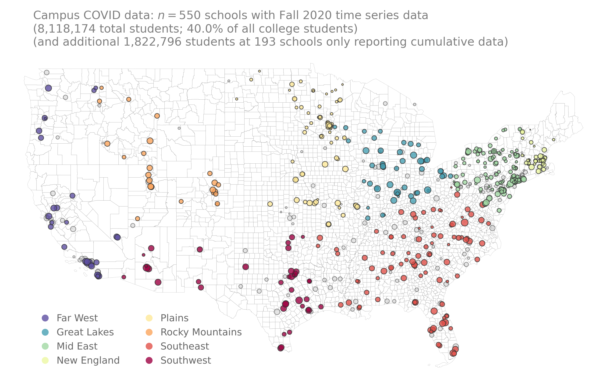

# campus-covid-data
crowdsourced dataset of COVID-19 testing and case counts at institutes of higher education


## Data and findings


- - - -

<p align="center">

</p>

**<p align="center">Current status of the Campus Covid dataset.**

## Notebooks
1. [Automate the creation of individual google sheets](https://github.com/campus-covid-data/code/create_google_sheets.ipynb)


## Installation and Usage

In order to use this code, first clone/download the repository. 
Below is a simple example usage. Please feel free to reach 
out if you find any bugs, have any questions, or if for some reason
the code does not run. 

### Requirements  <a name="requirements"/>

This code is written in [Python 3.x](https://www.python.org) and uses 
the following packages:

* [Pandas](https://pandas.pydata.org/)
* [Numpy](http://numpy.scipy.org/)
* [matplotlib](https://matplotlib.org)
* [geopandas](https://geopandas.org/) (for replicating the map figures)


## Citation   <a name="citation"/>

If you use findings from this work and/or some of the aggregated data provided in your own research, please cite the following:

Bibtex: 
```text
@article{klein2020distancing,
  title = {The emergence and persistence of collective physical distancing during the COVID-19 outbreak},
  author = {Brennan Klein and Timothy LaRock and Stefan McCabe and Leo Torres and Lisa Friedland and and Maciej Kos and Filippo Privitera and and Brennan Lake and Moritz U. G. Kraemer and John S. and Brownstein and David Lazer and Tina Eliassi-Rad and Samuel V. Scarpino and Matteo Chinazzi and Alessandro Vespignani},
  journal = {arXiv},
  year = {2020},
  url = {\url{https://www.mobs-lab.org/uploads/6/7/8/7/6787877/assessing_mobility_changes_in_the_united_states_during_the_covid_19_outbreak.pdf}}
}
```

## See also:

* Chinazzi, M., Davis, J.T., Ajelli, M., Gioannini, C., Litvinova, M., Merler, S., Pastore y Piontti, A., Mu, K., Rossi, L., Sun, K., Viboud, C., Xiong, X., Yu, H., Halloran, M.E., Longini Jr., I.M., & Vespignani, A. (2020). The effect of travel restrictions on the spread of the 2019 novel coronavirus (COVID-19) outbreak. *Science*. doi: [10.1126/science.aba9757](https://doi.org/10.1126/science.aba9757)
